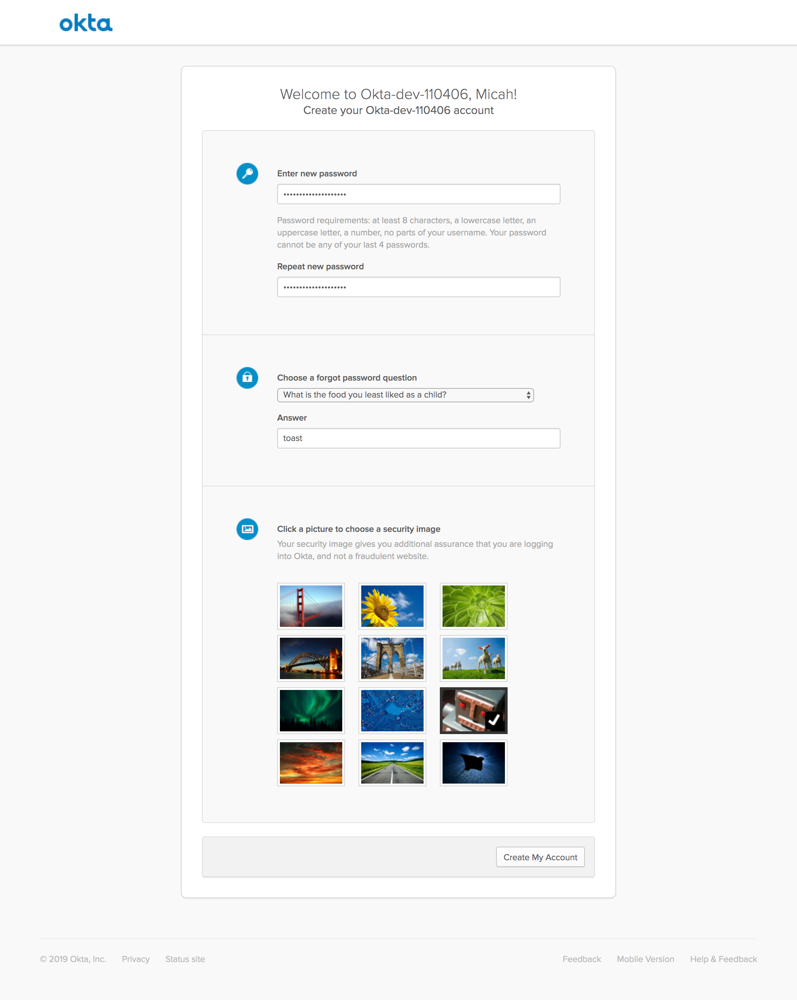
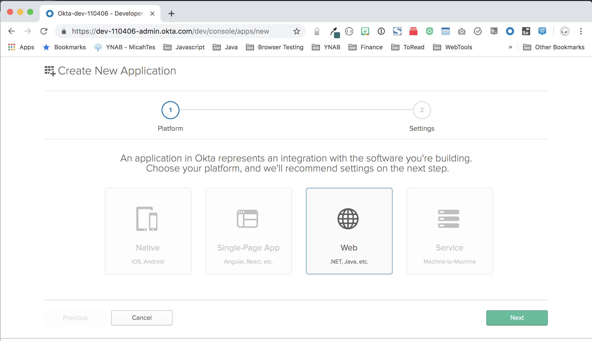
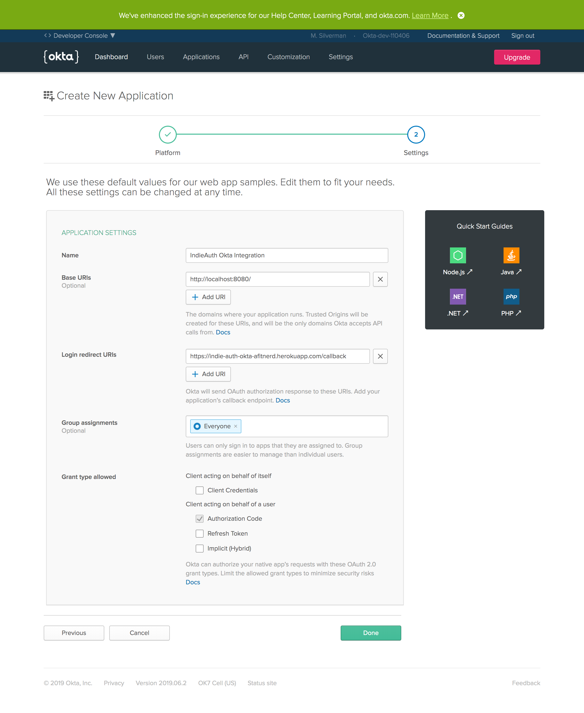
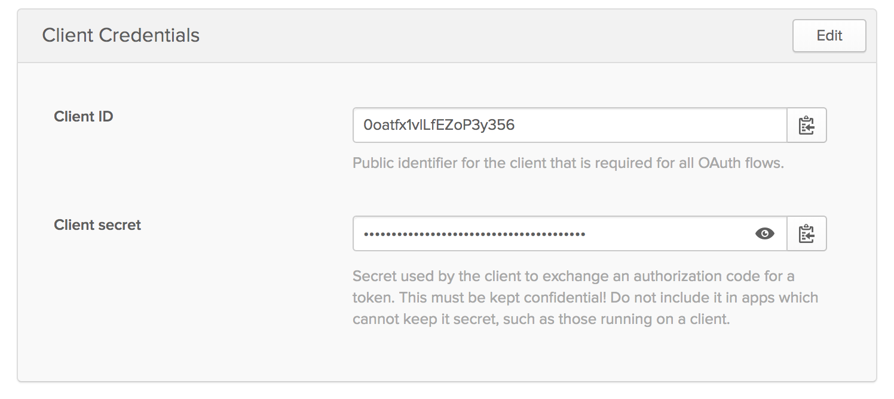

## IndieAuth Okta Integration

## Set Up Okta

Go to: [https://developer.okta.com/signup/](https://developer.okta.com/signup/) and create a free developer okta organization.

Click the verification link you receive in your email and put in the temporary password assigned to you.

You'll be asked to set a new password and provide some other basic information:

Navigate to: **Applications** and click **Add Application**.

Select **Web** and click **Next**

Give the app a name and fill in value for `Login redirect URIs`.

**Note:** This will be in the form: **https://&lt;heroku app name&gt;.herokuapp.com/callback**

Click **Done**.

Scroll down and capture the **Client ID** and **Client secret** values. We'll need these later.

## Deploy this App to Heroku

You can use the friendly purple button to deploy to heroku

You'll need to name your heroku app and provide some environment variable information after logging in to heroku.

**NOTE:** The name you assign to the herokuapp becomes the value used for the redirect uri.

| variable | description |
|----------|-------------|
| INDIEAUTH_AUTHORIZATION_ME_URI | your website. Ex: https://afitnerd.com |
| INDIEAUTH_AUTHORIZATION_REDIRECT_URIS | comma separated list of allowed IndieAuth redirect uris. ex: https://indielogin.com/redirect/indieauth |
| OKTA_OAUTH2_ISSUER | Your okta org issuer. This will be the base org with /oauth2/default tacked on to the end. Ex: https://micah.okta.com/oauth2/default  |
| OKTA_OAUTH2_CLIENT_ID | The Client ID you saved earlier |
| OKTA_OAUTH2_CLIENT_SECRET | The Client secret you saved earlier |
| OKTA_OAUTH2_REDIRECT_URI | The redirect uri you configured earlier. Ex: https://indie-auth-okta-afitnerd.herokuapp.com/callback |